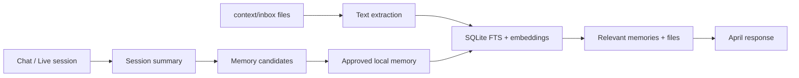

# April AI

A native macOS assistant that lives in your menu bar and desktop. April is built to be a fast, sarcastic, screen-aware thinking partner: talk to it, show it a screenshot when needed, let it remember useful context, and send expensive work to deep sandbox agents only when the task deserves it.


## Run

Recommended daily use: open the generated app bundle:

```text
../AprilAI.app
```

To rebuild that app bundle after code changes:

```bash
./scripts/make-app.sh
```

For new versions or local updates, use the reset flag so macOS privacy permissions do not get stuck on an old ad-hoc build identity:

```bash
./scripts/make-app.sh --reset-permissions
```

Then reopen April AI and grant Accessibility, Microphone, and Screen Recording again from Settings if macOS asks. Local dev builds are ad-hoc signed, and macOS privacy can keep stale permission records after rebuilds.

From this folder:

```bash
swift run
```

Use `swift run` only for development/debugging. It launches a raw executable, not a normal Dock app, so macOS can be weird about focus and app identity. You can also open `Package.swift` in Xcode and run the `AprilAI` target.

## First Setup

1. Open **Settings**.
2. Add your Gemini API key.
3. Keep the default text model, `gemini-3.5-flash`, or change it from the picker.
4. Keep the default Live model, `gemini-3.1-flash-live-preview`, for low-latency talk.
5. Open the **Context** tab.
6. Drop PDFs, Markdown, text files, notes, logs, or code into `context/inbox`.
7. Click **Index inbox**.
8. Optional: grant Microphone, Speech Recognition, Screen Recording, and Accessibility permissions if you want voice, screenshot/screen-share, or local-control tools.

### Local Mode Setup

The **Local** tab does not need a Gemini key. Start your local services, then open **Settings → Local Model** and keep or change these defaults:

- Unsloth chat server: `http://127.0.0.1:8888/v1`
- Cartesia Sonic text-to-speech: `sonic-3.6` with a configurable voice ID

Add the Unsloth token and Cartesia API key, save, then use **Test Local Services**. Local voice is intentionally turn-based: macOS Speech Recognition transcribes a recorded thought, Unsloth streams the response, and Cartesia Sonic speaks its short version. There is no hidden Gemini fallback or local TTS/transcription server.

If macOS does not focus the API key field when running from `swift run`, use **Paste Clipboard** or **Enter in Dialog** in Settings. You can also launch with an environment key:

```bash
GEMINI_API_KEY="your-key" swift run
```

Then click **Use Env Key** and **Save Gemini Settings**.

The default context folder is created on first launch at:

```text
~/Library/Application Support/AprilAI/context
```

You can choose another folder from the **Context** or **Settings** screen.

## Features

- **Talk naturally**: use Gemini Live for low-latency voice. April speaks short answers out loud, keeps the real answer in chat, and can keep talking while tools are working.
- **Share only what matters**: ask April to look at the screen or share frames during a Live session. It is not designed around permanent full-time screen surveillance.
- **Automatic context**: drop files into `context/inbox`, index once, and April can reference them later from local search.
- **Memory that grows**: turn useful sessions into attachable memory so April can remember goals, decisions, preferences, and key facts later. Basically the external brain humans kept asking evolution for, but with fewer headaches.
- **Deep agents**: send expensive research, code/data analysis, and artifact generation to Gemini Managed Agents in a remote sandbox, then track outputs in Agent Lab.
- **Grounded web search**: use Gemini Google Search grounding when the question needs current web facts.
- **Local-control tools**: optional Accessibility tools can open apps, use native UI actions, run safe shortcuts, type, and move the mouse when you explicitly ask.
- **Conversational Computer Use autopilot**: Live chat can run a bounded Gemini Computer Use loop for visual UI workflows and form filling. April now reports progress while it works, instead of going dead-silent like a toaster with anxiety.
- **Cheap by default**: normal chat uses fast Gemini models. Heavy sandbox agents are there for work that actually needs compute, browsing, or files.
- **Fully local chat path**: switch to **Local** for an Unsloth-hosted OpenAI-compatible model with its server-side web search, Python, and terminal tools enabled. It shares April's context and approved-memory system, but never receives macOS-control capabilities.
- **Low-overhead local voice turns**: macOS Speech Recognition transcribes recorded input and Cartesia Sonic speaks the short reply, so Local mode needs no Whisper or local TTS server.
- **Local-first project data**: context, memory, research outputs, indexes, and logs live in your chosen `context/` folder.

## Memory Architecture

April is not pretending to have mystical infinite memory. It uses a plain local folder plus SQLite indexing, because boring storage is how serious systems avoid becoming expensive soup.



The important bit: context is managed automatically after you add files and index them. You do not have to paste the same background into every conversation like a medieval scribe with Wi-Fi.

Memory is deliberately simple:

1. Talk through a session.
2. Let April summarize the important bits.
3. Save the useful memories.
4. Plug in one or more memory sessions when you want April reminded of that context.
5. Delete anything stale or wrong from the Memory tab.

That makes memory portable and user-owned: April recalls the sessions you attach, plus indexed local context, without needing you to re-explain the whole project every time.

## Deep Agents

Agent Lab is for heavyweight tasks:

- long research with citations,
- code or data analysis,
- sandbox file/artifact generation,
- computations that should not block casual conversation,
- tasks April should track while you keep working.

The normal assistant stays fast. When the work gets heavier, April can launch a managed sandbox agent and save the result under `context/research`.

## Computer Use Autopilot

When you explicitly ask April to do a visual task, Live can start a Gemini Computer Use loop: screenshot, propose an action, execute locally, screenshot again, repeat. It is meant for UI workflows, browser pages, custom app surfaces, and form filling where raw coordinate guessing was too brittle.

Default policy is **Run until risky**. April can do reversible clicks, typing, scrolling, waits, and navigation, but pauses before sending, buying, deleting, submitting final forms, typing secrets, accepting terms, or changing security settings.

While autopilot runs, April posts lightweight progress updates in chat and can speak short status lines:

- **Looking**: reading the current screen.
- **Clicking / Typing / Waiting**: executing the next reversible action.
- **Checking result**: capturing the next screen state.
- **Steering**: applying a correction you gave mid-run.

The default Live autopilot run is capped at **6 steps** unless you explicitly ask for a longer run. This keeps the conversation responsive and prevents one messy UI task from turning into an archaeological expedition.

## Project Layout

The Swift package target is organized by domain under `Sources/AprilAI/`:

- `App/`: app entry point, shared state, and common models.
- `UI/`: SwiftUI views and text-input helpers.
- `Gemini/`: Gemini REST client, Live session, prompts, speech, voice recording, screen capture, and Live tool execution.
- `Local/`: OpenAI-compatible Unsloth chat streaming, macOS Speech transcription, and Cartesia Sonic speech clients.
- `Context/`: local context folder handling and SQLite indexing.
- `Memory/`: durable memory storage.
- `Control/`: Accessibility, keyboard, mouse, app-control, and grid-overlay helpers.
- `Logging/`: local interaction logging.
- `Security/`: Keychain API-key storage.

## CI Smoke Tests

GitHub Actions runs offline smoke checks on pushes and pull requests to `main`:

- `swift build`
- `swift scripts/smoke-computer-use.swift`
- `swift scripts/smoke-shortcuts.swift`
- `swift scripts/smoke-coordinate-mapping.swift`
- `swift scripts/smoke-memory-brain.swift`
- `swift scripts/smoke-local-mode.swift`
- `swiftc -parse scripts/smoke-live.swift`

The Live smoke script is parse-checked in CI instead of opening a real Gemini socket, so public contributors do not need secrets just to verify the project.

## Roadmap

- Integrate open-source Live models for lower-cost local voice loops.
- Move more inference local where it makes sense.
- Improve native app control without needing cursor gymnastics.
- Keep shrinking the setup until April feels like a personal operating layer, not a science project.
